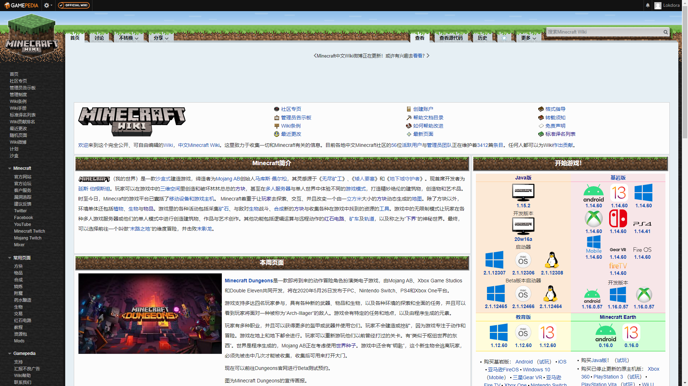
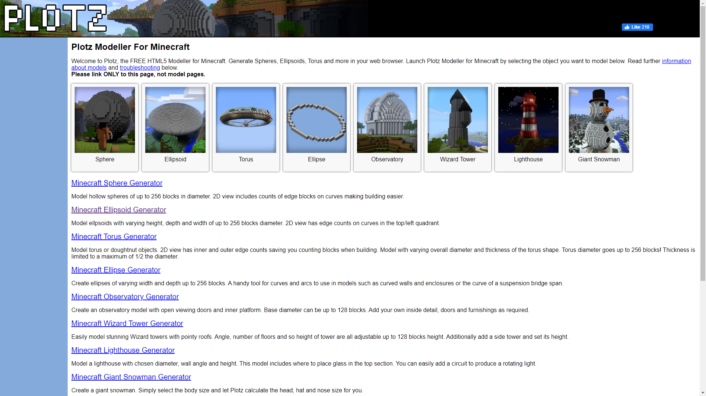
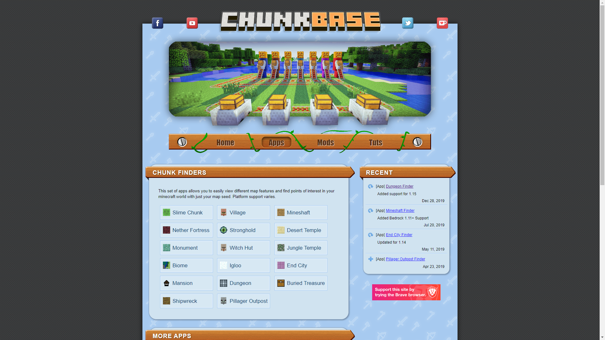
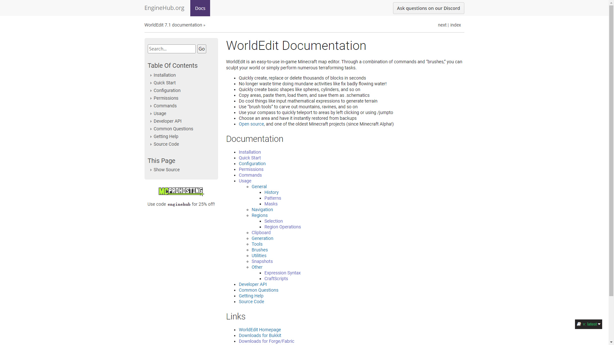

# 新手指南

## 关于Minecraft

1. **用户名或玩家ID只由字母，数字和下划线构成，长度限制为3-16位**，即使玩盗版，也要遵守一下正常规则，否则可能出现问题
2. Minecraft已售出1.8亿份，月活跃玩家超一亿，是当之无愧的全世界最畅销/活跃的游戏（这个必须得吹一波

## 关于服务器

1. 服务器基本形式是多人可以一同游玩的minecraft，既然是多人就需要遵守社区规则

## 关于本服

1. 本服现在平台为paper 1.15.2，与原版行为不同请见谅

## 友情链接

1. 本服 [主页](https://mc.alicespace.cn/#/)

2. 官方wiki，你的大多数问题在这里都有解答 [Official Minecraft Wiki(chs)](https://minecraft-zh.gamepedia.com/Minecraft_Wiki)

   

3. mc画圆专用 [Plotz Modeller For Minecraft](https://www.plotz.co.uk/)

   

4. 找结构专用，本服[种子]([https://minecraft-zh.gamepedia.com/%E7%A7%8D%E5%AD%90%EF%BC%88%E4%B8%96%E7%95%8C%E7%94%9F%E6%88%90%EF%BC%89](https://minecraft-zh.gamepedia.com/种子（世界生成）))公开 [chunkbase](https://www.chunkbase.com/)

   

5. 创造专用，本服设有创造服 [worldedit](https://worldedit.readthedocs.io/en/latest/)

   